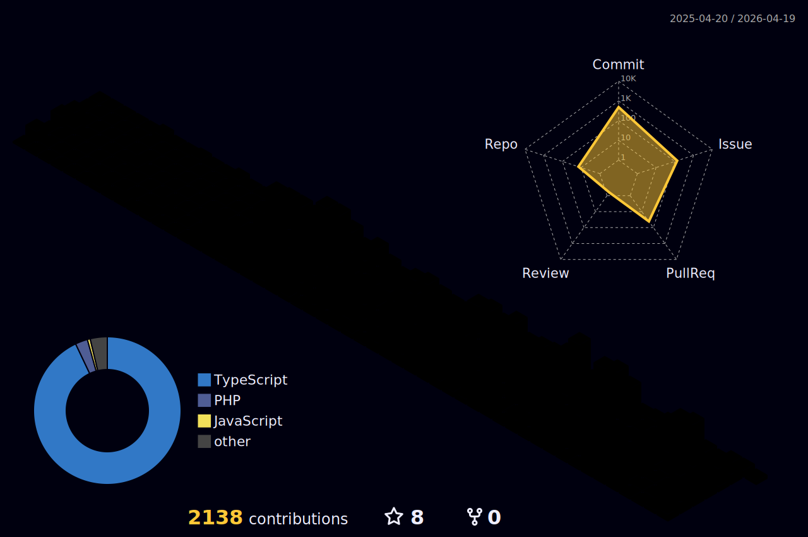

<!-- HEADER ANIMADO -->

<!-- TYPING LINE -->

  

---

## 📈 Atividade no GitHub

  

  
  

  

---

## 🧰 Tech Stack

<table align="center">
  <tr>
    <td align="center" width="140"><b>Frontend</b></td>
    <td align="center" width="140"><b>Mobile</b></td>
    <td align="center" width="140"><b>Backend</b></td>
    <td align="center" width="140"><b>Cloud & Deploy</b></td>
    <td align="center" width="140"><b>Tools</b></td>
  </tr>
  <tr>
    <td align="center">
       
       
      
    </td>
    <td align="center">
       
      React Native
    </td>
    <td align="center">
      
    </td>
    <td align="center">
      
    </td>
    <td align="center">
      
    </td>
  </tr>
</table>

---

## 🔥 Projetos em Destaque

### 🌐 Projetos Online

### 📂 Repositórios

---

## 📫 Contato

  
  
  

---

## 👨🏻‍💻 Sobre mim
Apaixonado por evolução e tecnologia. Estudante de **Ciência da Computação (UNAMA • Belém/PA)**. Hoje foco em **Front-end e Mobile** e estou avançando para **Full-Stack** (Node.js, APIs, automações). Interesses futuros: **IA** e **Robótica**.

---

## 👀 Visitantes

  

---

<!-- FOOTER ANIMADO -->

